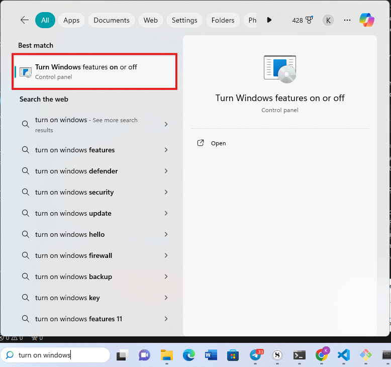
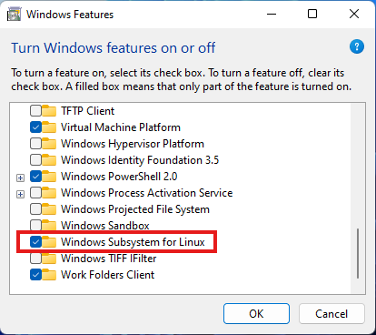

# Sunbird AI API


This repository contains code for the publicly accessible Sunbird AI APIs.

To get started using the API, [view the tutorial](tutorial.md).

## Getting started locally on Windows

#### Ensure virtualization is enabled on your computer

This is required because CPU virtualization is needed for Windows to emulate Linux. For more on enabling [virtualization](https://www.ninjaone.com/blog/enable-hyper-v-on-windows/).

#### Ensure your windows is fully updated.

Install [WSL](https://learn.microsoft.com/en-us/windows/wsl/install) (Windows Subsystem for Linux). This is required because redis is not officially supported on Windows.

### Downloading, Setting Up, and Configuring WSL on Windows
-  Open PowerShell as an Administrator and run the following command to enable WSL:
    ```powershell
    wsl --install
    ```
-  Restart your computer if prompted.
-  Once the system restarts, set up your Linux distribution (e.g., Ubuntu) from the Microsoft Store.

### After successfully installing `wsl`:

- Press windows button and in the search bar type `windows features on or off`
- Click on `Turn Windows features on or off` and a pop-up window will appear

- Ensure option `Windows Subsystem for Linux` is checked

  

- Restart your computer and launch Ubuntu

### Cloning the API Repository Locally on Your Windows Machine
- Open your WSL terminal (e.g., Ubuntu).
- Navigate to the directory where you want to clone the repository:
  ```bash
  cd /mnt/c/your-directory
  ```
- Clone the Sunbird AI API repository:
  ```bash
  git clone https://github.com/SunbirdAI/sunbird-ai-api.git
  ```

- Continue with `Getting started locally on Linux/macOS`

## Getting started locally on Linux/macOS
To run the app locally:
- Create and activate a local environment

    ```bash
    python3 -m venv .venv
    source .venv/bin/activate
    ```
- Install the requirements:
    ```bash
    pip install -r requirements.txt
    ```
- Set the environment variables in a `.env` file, the following variables are required:
    ```
    ENDPOINT_ID
    PROJECT_ID
    SECRET_KEY
    DATABASE_URL
    RUNPOD_API_KEY
    REDIS_URL
    RUNPOD_ENDPOINT
    AUDIO_CONTENT_BUCKET_NAME
    ```
 ### Install [Redis](https://redis.io/), this is required for the Rate Limiting functionality.
```bash
sudo apt update && sudo apt install redis-server
```
- Start the Redis sever:
    ```bash
    sudo service redis-server start
    ```
- Verify that Redis is running:

    ```bash
    redis-cli ping
    ```


### Setting Up and Configuring PostgreSQL Server on WSL
- Install PostgreSQL:
    ```bash
  sudo apt-get install postgresql postgresql-contrib
  ```
- Start the PostgreSQL service:
  ```bash
  sudo service postgresql start
  ```

-  Switch to the PostgreSQL user:
   ```bash
   sudo -i -u postgres
     ```

-  Open the PostgreSQL interactive terminal:
   ```bash
   psql
    ```

### Install [tailwind css](https://tailwindcss.com/docs/installation).
- Run tailwind in a separate terminal tab:

    ```bash
    npx tailwindcss -i ./app/static/input.css -o ./app/static/output.css --watch
    ```
This step is only necessary if you're going to make changes to the frontend code.

### Creating PostgreSQL Database and Running Alembic Migrations
- Create a new database:
    ```sql
    CREATE DATABASE sunbird_ai;
    ```
-  Exit the PostgreSQL interactive terminal:
    ```sql
    \q
    ```
- Navigate to the API repository directory and run Alembic migrations:
    ```bash
    cd /mnt/c/your-directory/sunbird-ai-api
    alembic upgrade head
    ```
- Run the app:
    ```bash
    uvicorn app.api:app --reload
    ```

### Running the migrations with alembic:
- After making a change to the models, run the command below to make the migrations:
    ```bash
    alembic revision --autogenerate -m 'message'
    ```

- Check the created migration file in `app/alembic/versions` to ensure it does what's expected.
- Apply the migration with:
    ```bash
    alembic upgrade head
    ```


## Deployment
The app is deployed on Google Cloud Run and is backed by PostgreSQL DB hosted in Google Cloud SQL.

## Other docs
- Checkout the [System design document](https://github.com/SunbirdAI/sunbird-docs/blob/main/06-design-docs/language/API_Framework.md) (you need to part of the Sunbird organization to view this).
- Checkout the [Deployment Guide](https://github.com/SunbirdAI/sunbird-ai-api/blob/main/api-deployment-docs.md).
