# API ARCHITECTURE DOCUMENTATION

## API Models

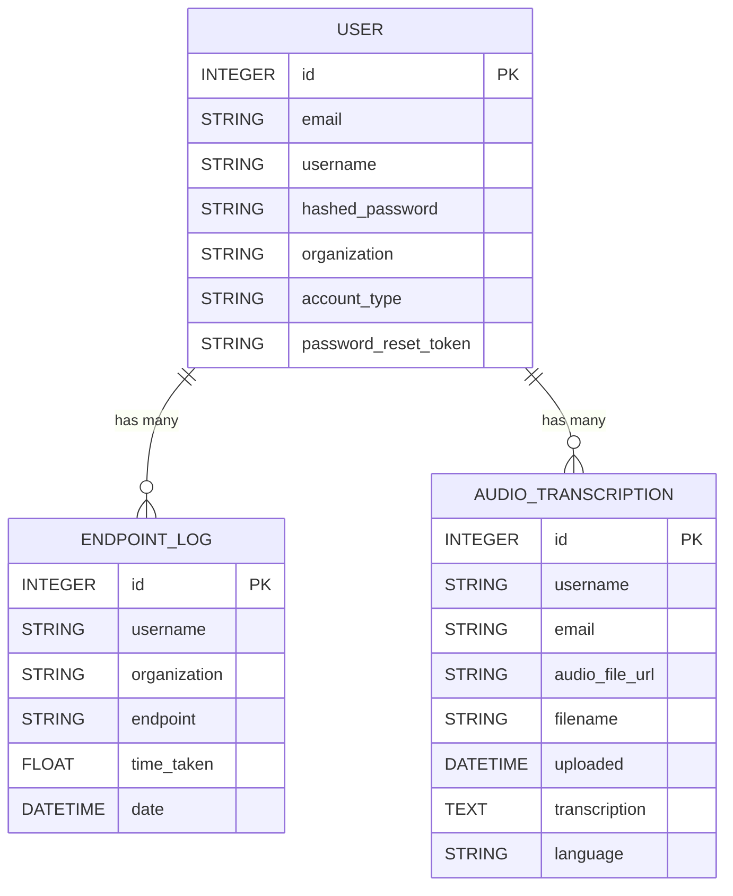

## API Tasks Endpints

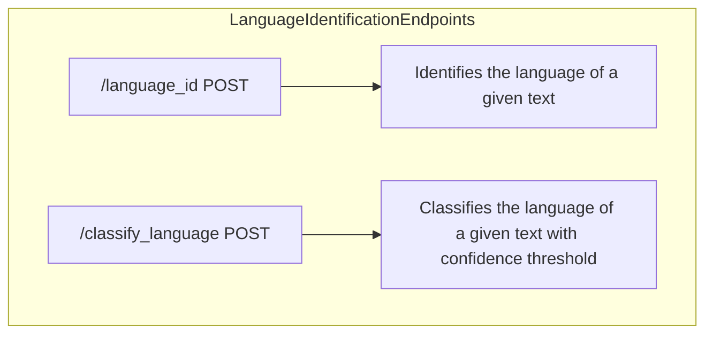

### Description of Each Endpoint:

1. **/language_id POST**
   - **Purpose**: This endpoint identifies the language of a given text.
   - **Supported Languages**: Acholi (ach), Ateso (teo), English (eng), Luganda (lug), Lugbara (lgg), and Runyankole (nyn).
   - **Behavior**: It uses an external language detection service (`runpod.Endpoint`) to identify the language by submitting the text for processing.
   - **Error Handling**: 
      - If the job times out, it returns a 408 (Request Timeout) status code.
      - Successful response includes the detected language.

2. **/classify_language POST**
   - **Purpose**: Similar to `/language_id`, but adds an additional classification layer with confidence thresholding.
   - **Supported Languages**: Same as `/language_id` endpoint.
   - **Behavior**: 
      - Converts the input text to lowercase and uses a threshold of 0.9 to ensure only languages with high confidence are identified.
      - If no language exceeds the threshold, it returns "language not detected."
   - **Error Handling**:
      - Manages both timeout and general exceptions, returning appropriate HTTP status codes and messages
    

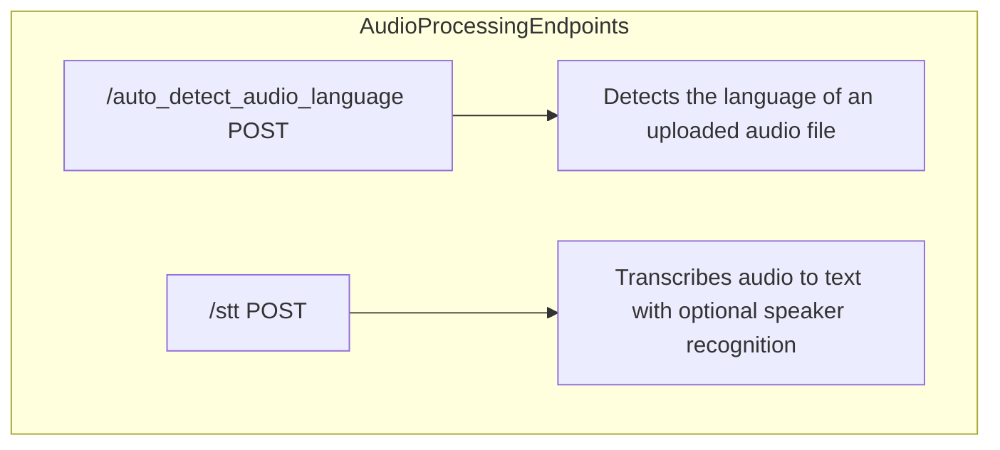

### Description of Each Endpoint:

1. **/auto_detect_audio_language POST**
   - **Purpose**: Accepts an audio file and identifies its language.
   - **Behavior**:
      - Saves the uploaded audio file temporarily, uploads it to a storage location, and then deletes the local file.
      - Uses a language detection service to analyze the audio file.
      - Logs performance metrics like elapsed time.
   - **Error Handling**:
      - Returns a 503 status code if there’s a timeout or connection issue.

2. **/stt POST**
   - **Purpose**: Transcribes an uploaded audio file into text, with optional settings for speaker recognition and Whisper model processing.
   - **Behavior**:
      - Supports parameters like `language`, `adapter`, `recognise_speakers`, and `whisper` to customize the transcription.
      - Uploads the audio file to storage, uses a transcription service, and stores results in a database if successful.
      - Logs the endpoint usage with time tracking and stores transcription data in the database for later reference.
   - **Error Handling**:
      - Returns a 503 status code in case of timeout or connection issues.

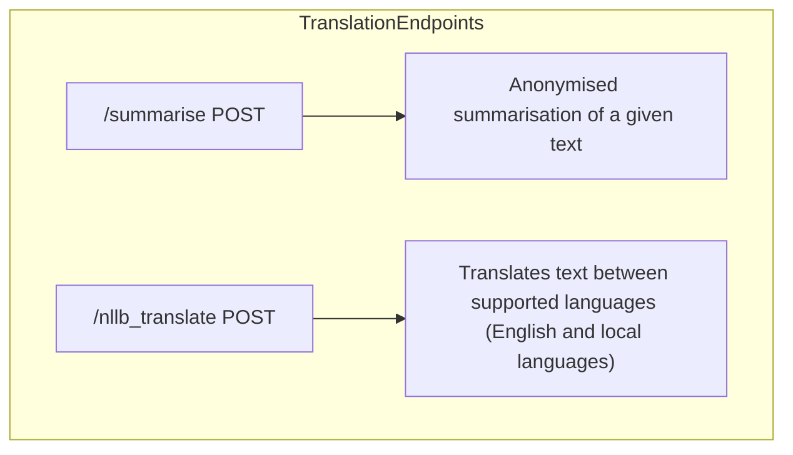

### Description of the `/nllb_translate` Endpoint:

1. **/summarise POST**
   - **Purpose**: Provides anonymized summarization for a given text input.
   - **Supported Languages**: English (eng) and Luganda (lug).
   - **Behavior**:
      - Uses a specified endpoint to perform the summarization task.
      - Logs details, including elapsed time, to help monitor performance.
   - **Error Handling**:
      - Returns a 503 status code if there’s a timeout or connection issue.

2. **/nllb_translate POST**
   - **Purpose**: Translates text between English and a set of local languages, including Acholi (ach), Ateso (teo), Luganda (lug), Lugbara (lgg), and Runyankole (nyn).
   - **Behavior**:
      - Accepts source and target languages as input parameters and restricts translation to/from English and the specified local languages.
      - Utilizes an external translation service (`runpod.Endpoint`) to perform the translation task.
      - Logs the request in the database, including the elapsed time for tracking performance.
   - **Error Handling**:
      - Manages potential errors by:
         - Returning a 503 status code if there’s a timeout or connection issue.
         - Returning a 500 status code for any other unexpected errors.

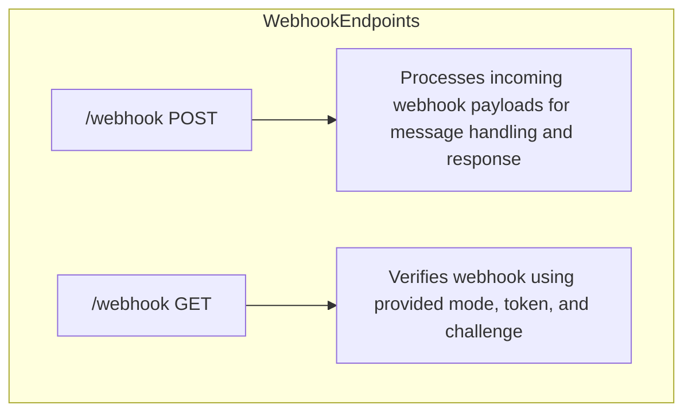

### Description of Each Webhook Endpoint:

1. **/webhook POST**
   - **Purpose**: Processes incoming payloads from a webhook, often used for receiving and handling messages from an external service (e.g., messaging platforms).
   - **Behavior**:
      - Validates the payload to ensure it meets required criteria.
      - Extracts key information such as the sender's phone number, name, and target language preference.
      - Generates a response message using the extracted data, leveraging an AI service (OpenAI) to create or format the message if necessary.
      - Sends the generated message back to the sender using the specified phone number ID and a secure token.
   - **Error Handling**:
      - Logs any errors that occur during processing.
      - Returns a 500 status code if an internal server error arises during processing.

2. **/webhook GET**
   - **Purpose**: Verifies the webhook subscription by checking provided parameters against server-stored values.
   - **Behavior**:
      - Accepts query parameters (`mode`, `token`, and `challenge`).
      - Verifies if the `mode` is set to "subscribe" and if the `token` matches the stored verification token.
      - Returns the challenge code upon successful verification.
   - **Error Handling**:
      - Returns a 403 status code if the verification fails due to invalid mode or token.
      - Returns a 400 status code if required parameters are missing.

## API Frontend Endpoints

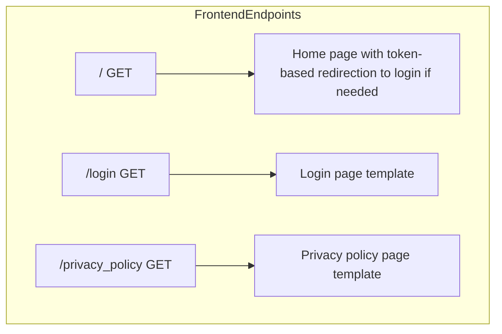

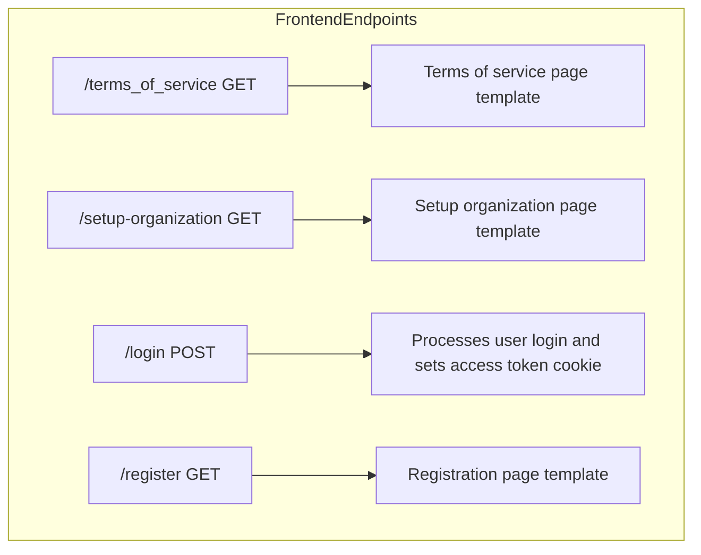

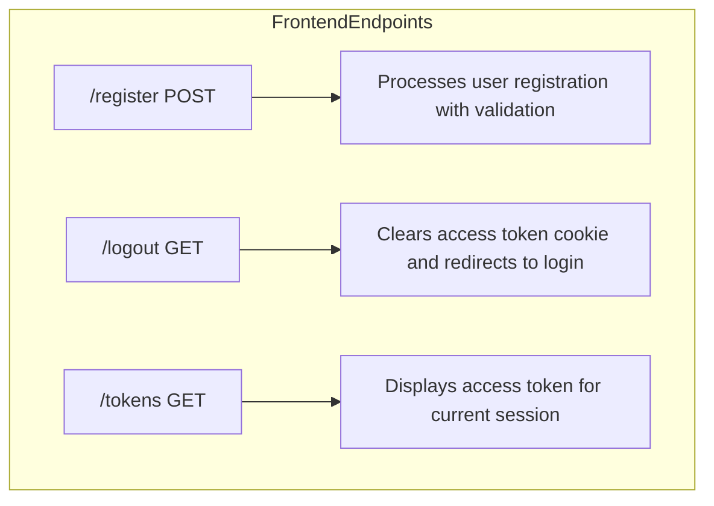

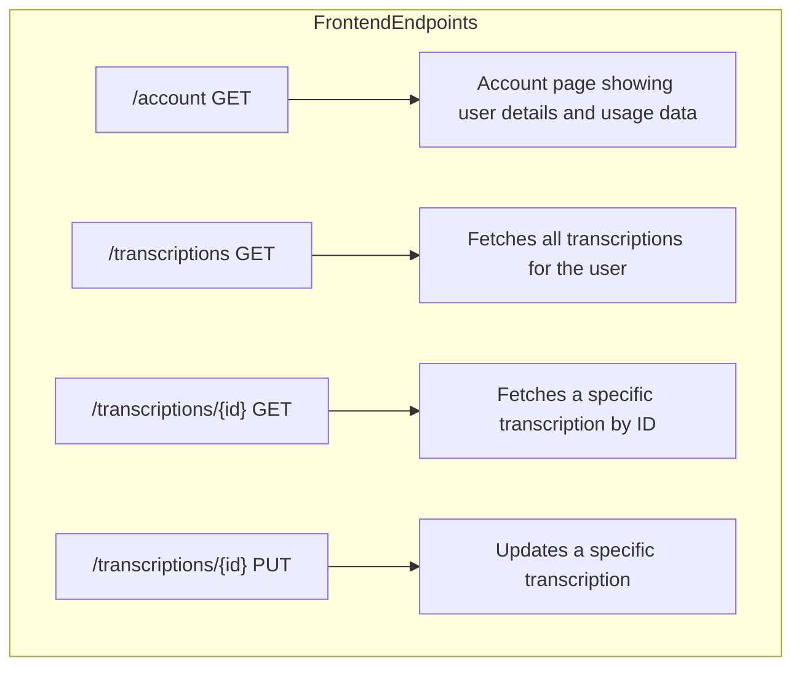

### Descriptions of Each Frontend Endpoint:

1. **/ GET**:
   - **Purpose**: Serves as the home page, checking for an access token to determine whether to display the main content or redirect to the login page.

2. **/login GET**:
   - **Purpose**: Displays the login page template.

3. **/privacy_policy GET**:
   - **Purpose**: Renders the privacy policy page.

4. **/terms_of_service GET**:
   - **Purpose**: Displays the terms of service page.

5. **/setup-organization GET**:
   - **Purpose**: Shows the setup organization page template.

6. **/login POST**:
   - **Purpose**: Processes the login form, authenticates the user, and sets an access token cookie if successful.
   - **Behavior**: Redirects to the home page upon successful login, with an alert message.

7. **/register GET**:
   - **Purpose**: Displays the registration page template.

8. **/register POST**:
   - **Purpose**: Processes the registration form and validates user data, including checking for unique email and username.
   - **Behavior**: Redirects to the login page upon successful registration with an alert message.

9. **/logout GET**:
   - **Purpose**: Logs out the user by deleting the access token cookie and redirecting to the login page.

10. **/tokens GET**:
   - **Purpose**: Displays a page showing the current session's access token for the user.

11. **/account GET**:
   - **Purpose**: Renders the account page with user details like username, organization, account type, and usage data.

12. **/transcriptions GET**:
   - **Purpose**: Returns a list of all audio transcriptions for the logged-in user.
   - **Behavior**: Displays transcription details like ID, username, email, filename, and transcription text.

13. **/transcriptions/{id} GET**:
   - **Purpose**: Fetches a specific transcription by its ID for the logged-in user.

14. **/transcriptions/{id} PUT**:
   - **Purpose**: Updates an existing transcription with new text, allowing users to make corrections or improvements.

## API Auth Endpoints

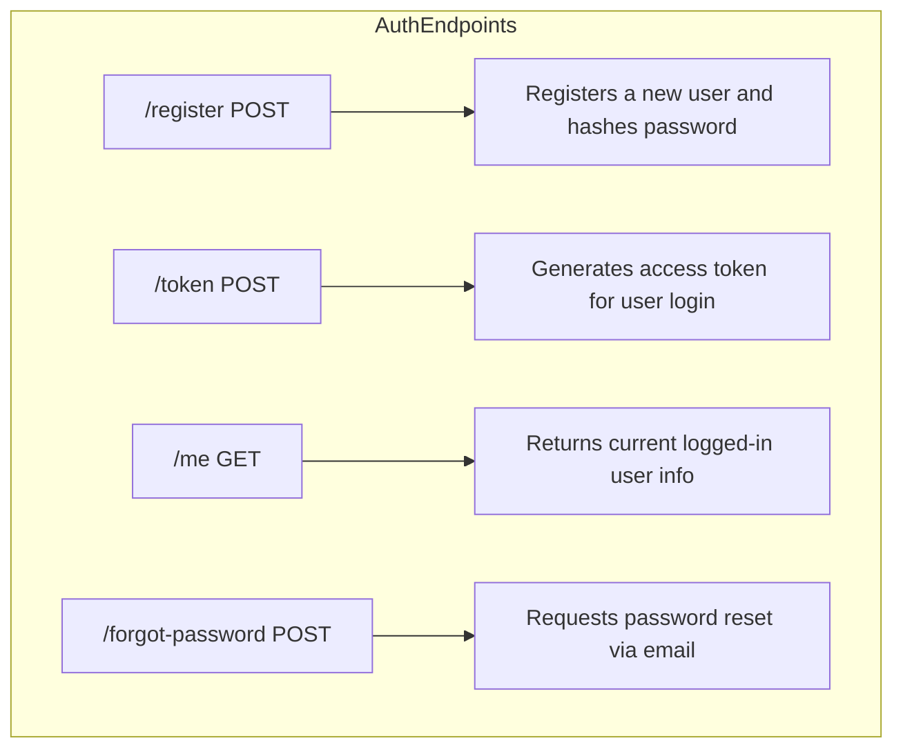

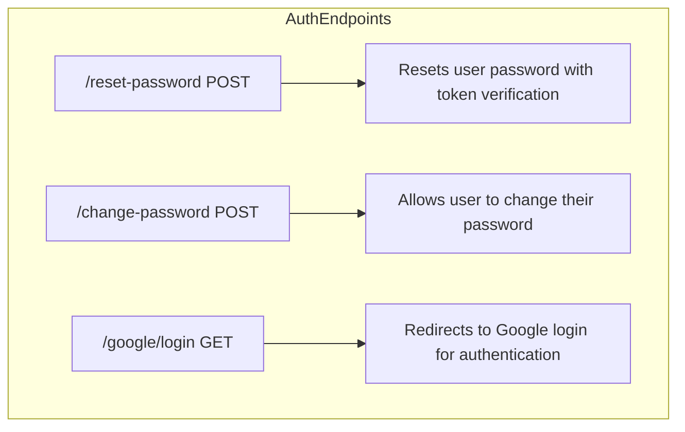

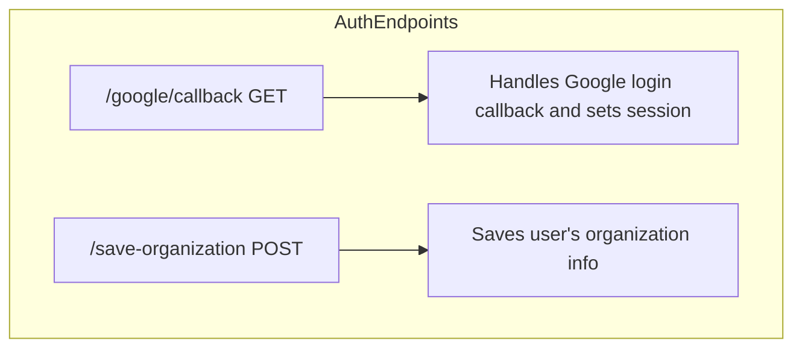

### Descriptions of Each Authentication Endpoint:

1. **/register POST**
   - **Purpose**: Registers a new user by saving their data and hashed password in the database.
   - **Behavior**: Checks for unique email and username, hashes the password, and saves user data to the database.

2. **/token POST**
   - **Purpose**: Authenticates the user and provides an access token.
   - **Behavior**: Validates user credentials and issues a JWT token for use in authenticated requests.

3. **/me GET**
   - **Purpose**: Retrieves information about the currently logged-in user.
   - **Behavior**: Returns the current user's information based on the access token.

4. **/forgot-password POST**
   - **Purpose**: Initiates a password reset process by sending an email with a reset link.
   - **Behavior**: Checks if the email is registered and generates a reset token, which is sent to the user's email.

5. **/reset-password POST**
   - **Purpose**: Resets a user's password by verifying the reset token and setting a new password.
   - **Behavior**: Verifies the reset token, hashes the new password, and updates it in the database.

6. **/change-password POST**
   - **Purpose**: Allows a logged-in user to change their password.
   - **Behavior**: Verifies the old password, hashes the new password, and updates the user record.

7. **/google/login GET**
   - **Purpose**: Redirects the user to Google for OAuth authentication.
   - **Behavior**: Initiates Google login, with a callback URI for returning to the application after authentication.

8. **/google/callback GET**
   - **Purpose**: Processes the Google login callback, checks if the user exists, and sets an access token.
   - **Behavior**: Retrieves user information from Google, creates a new user if they don’t exist, and sets an access token.

9. **/save-organization POST**
   - **Purpose**: Saves the organization information for the logged-in user.
   - **Behavior**: Updates the user’s organization details in the database and redirects to the account page.
